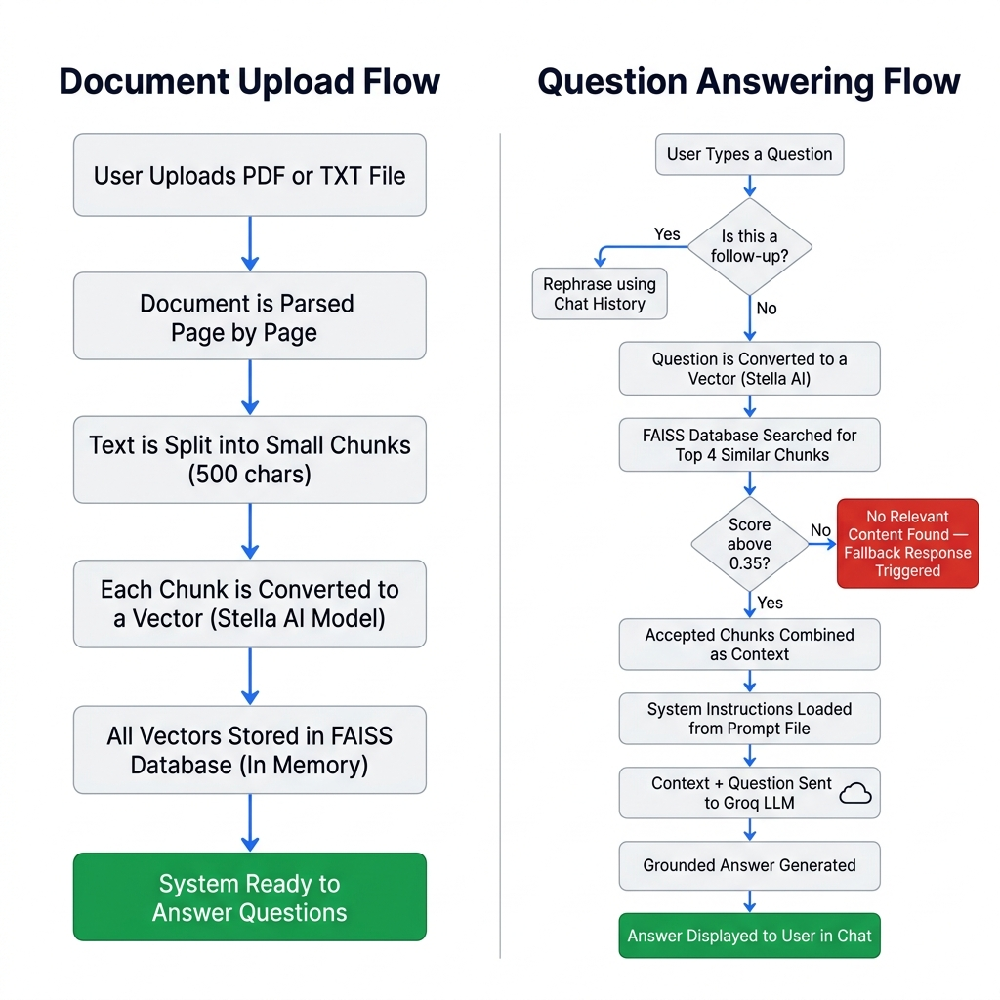

# FAQ RAG Chatbot

An intelligent, retrieval-grounded assistant designed to answer user questions strictly using content from a provided company FAQ document. Built using **Retrieval-Augmented Generation (RAG)**, the chatbot ensures every response is factually grounded in your document to prevent hallucinations.

It includes **conversational query condensation** (supporting follow-up questions like "explain again" or "tell me more") and a custom **similarity-threshold filter** that declines questions outside the scope of the FAQ.

---

## ⚙️ How It Works (System Flow)

Below is the architecture diagram detailing the document upload/indexing pipeline and the multi-turn question-answering workflow:



### Core Pipeline Steps:
1. **Ingestion & Chunking:** Documents (`.pdf` or `.txt`) are loaded, parsed, and split into overlapping text chunks of 500 characters.
2. **Local Embeddings:** Text chunks are vectorized using the high-performance open-source embedding model `dunzhang/stella_en_400M_v5` running locally.
3. **In-Memory Vector Database:** Vectors are indexed in an in-memory **FAISS** database using Cosine Similarity.
4. **Conversational Rephrasing:** Follow-up questions are automatically rephrased into standalone search queries using past chat history.
5. **Quality Filtering:** Chunks matching the query are filtered using a strict similarity cutoff score of `>= 0.35` to prevent irrelevant context from poluting the prompt.
6. **Grounded Generation:** Valid contexts are formatted into a secure prompt and sent to the **Groq API** running `llama-3.1-8b-instant` with a temperature of `0.1` for deterministic, grounded, and citation-backed responses.

---

## 🛠️ Tech Stack & Dependencies

- **Orchestration:** LangChain (Classic QA Chain and Custom Retriever Wrapper)
- **Vector Database:** FAISS-CPU (In-Memory)
- **Local Embeddings:** SentenceTransformers (`dunzhang/stella_en_400M_v5`)
- **LLM Engine:** Groq API (`llama-3.1-8b-instant`)
- **User Interface:** Gradio (with a custom minimalist black/white theme)

---

## 🚀 Setup & Installation

### 1. Prerequisites
Ensure you have **Python 3.10+** installed on your system.

### 2. Clone the Repository
```bash
git clone <your-repository-url>
cd FAQ_RAG
```

### 3. Install Dependencies
```bash
pip install -r requirements.txt
```

### 4. Configure Environment Variables
Copy the `.env.example` file to create a `.env` file:
```bash
copy .env.example .env
```
Open the `.env` file and enter your free **Groq API Key**:
```env
GROQ_API_KEY=gsk_...
```
*(Get a free key from the [Groq Console](https://console.groq.com/))*

---

## 💻 Running the Application

To run the application with **Gradio Auto-Reload Mode** (which automatically restarts the server and updates the browser as you edit code or prompts):

```bash
python -m gradio src/app.py
```

Open your browser and navigate to the local URL shown (typically `http://127.0.0.1:7860`).

---

## 📁 Project Directory Structure

```text
FAQ_RAG/
├── .env                          # Local environment variables (ignored by git)
├── .gitignore                    # Git exclusions
├── requirements.txt              # Project packages
├── system_flow.png               # Architecture flow diagram
├── prompts/
│   └── system_prompt.txt         # System instructions for LLM grounding rules
└── src/
    ├── config.py                 # Hyperparameters (chunk size, thresholds, models)
    ├── ingest.py                 # Document processing & Stella embedding patches
    ├── retriever.py              # ThresholdRetriever cosine similarity filtering
    ├── chain.py                  # LLM setup & Conversational query condensation
    └── app.py                    # Gradio layout & Custom styling
```
